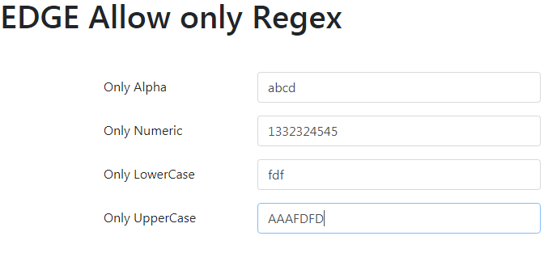

# regex validation angularjs
It is a directive component to help regex validation in angular JS form fields.

# Why we go for Regex validation?
On time of entering keys into a input field, it just takes the entered input and matched with that given regex and returns the result. If it is true leaves the entered key as it is if not empty the entered key so wrong characters are automatically not allowed inside the input field. It is done with the use of custom directive in Angular JS.

For example see the below image, here we validated only alphabets, only uppercase, only lowercase, only numbers for sample.

    

